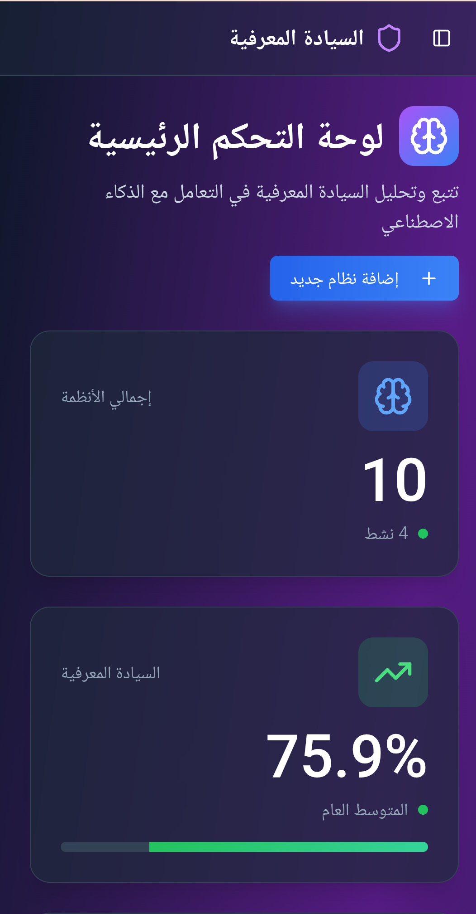
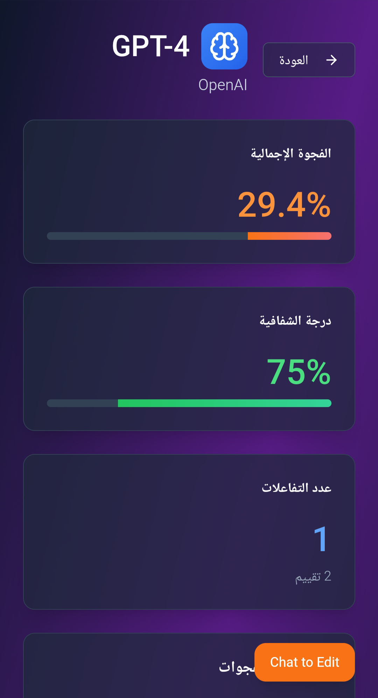
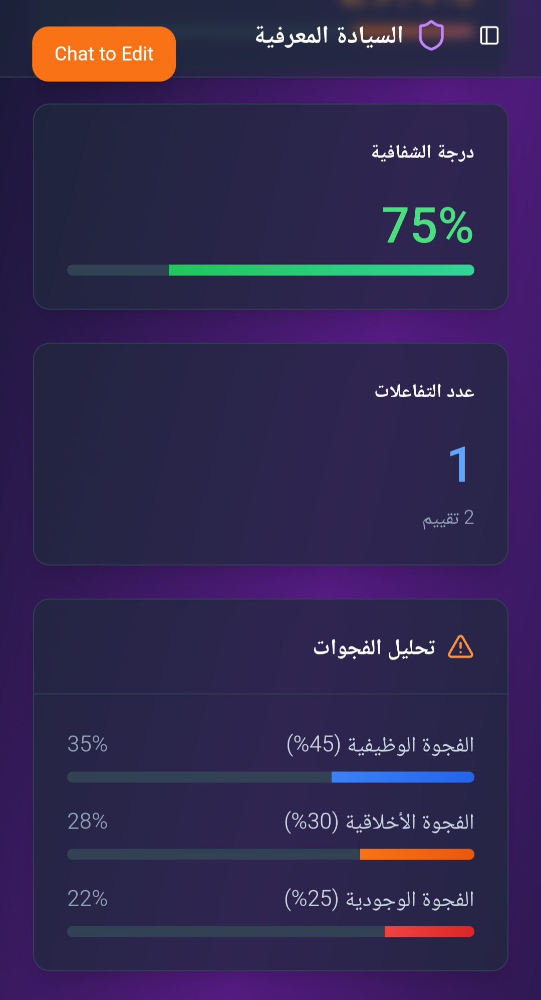

# 🧭 البوصلة المعرفية | Cognitive Compass

<div align="center">

[](https://app-5c655e46.base44.app/)
[](https://github.com/riteofrenaissance)
[](docs/AI_SYSTEMS.md)
[](#)
[](https://app-5c655e46.base44.app/)
[](https://github.com/riteofrenaissance/ecf-compass/stargazers)
[](https://github.com/riteofrenaissance/ecf-compass/issues)
[](LICENSE)


</div>

---

## 📋 Overview

**Cognitive Compass** (البوصلة المعرفية) is an interactive assessment tool that provides instant analysis of cognitive sovereignty in human-AI interactions. Unlike long-term monitoring dashboards, the Compass focuses on immediate, detailed evaluation of individual interactions.

## 🤖 Tracked AI Systems (10)

### Text Generation (4)
- **Claude 3** (Anthropic) - 85% sovereignty ⭐
- **GPT-4** (OpenAI) - 75% sovereignty
- **Gemini Pro** (Google) - 65% sovereignty
- **Jasper AI** - 55% sovereignty

### Image Generation (3)
- **Stable Diffusion** - 70% sovereignty
- **DALL-E 3** (OpenAI) - 60% sovereignty
- **Midjourney** - 45% sovereignty ⚠️

### Specialized Tools (3)
- **DeepL Translator** - 90% sovereignty 🏆
- **IBM Watson** - 80% sovereignty
- **GitHub Copilot** - 50% sovereignty

[View detailed comparison →](docs/AI_SYSTEMS.md)

## 🚀 Quick Start

### Try Live Demo
Visit **[app-5c655e46.base44.app](https://app-5c655e46.base44.app/)**

### First Time Setup
1. Open the Compass
2. Click "إضافة نظام جديد" (Add New System)
3. Select an AI you use regularly
4. Complete the initial assessment
5. Review your sovereignty score

### Understanding Your Score
- **90-100%**: Excellent sovereignty 🏆
- **76-89%**: Strong control ⭐
- **51-75%**: Good awareness ✅
- **26-50%**: Needs attention ⚠️
- **0-25%**: High dependency risk 🔴

  ---
  
### Key Features

- 🎯 **Instant Sovereignty Score**: Real-time calculation (0-100%)
- 📊 **Three-Dimensional Metrics**:
  - Operational Awareness (35% weight)
  - Critical Engagement (40% weight)
  - Agency Preservation (25% weight)
- 🔍 **Gap Analysis**: Three types of gaps
  - 🔵 Functional Gaps (45%)
  - 🟠 Ethical Gaps (30%)
  - 🔴 Existential Gaps (25%)
- 💬 **Interaction Tracking**: Monitor conversations with specific AIs
- 📅 **Historical Assessments**: Track sovereignty evolution over time
- 🏷️ **Interaction Tagging**: Classify conversations by type

---

## 🏗️ Part of the Evolutionary Core Framework

```
ecf-theory (Foundation)
    ↓
ecf-compass (Assessment) ← You are here
    ↓
ecf-dashboard (Monitoring)
    ↓
Continuous Improvement
```

### Related Projects
- **[ecf-theory](https://github.com/riteofrenaissance/ecf-theory)** - Theoretical framework
- **[ecf-dashboard](https://github.com/riteofrenaissance/ecf-dashboard)** - Long-term monitoring
- **[ecf-study-aperture](https://github.com/riteofrenaissance/ecf-study-aperture)** - RCT research
- **[ecf-study-interactions](https://github.com/riteofrenaissance/ecf-study-interactions)** - Pattern analysis

---

## ✨ Features in Detail

### 1. Cognitive Sovereignty Score

The main metric that aggregates three dimensions:

```typescript
Sovereignty Score = 
  (Operational Awareness × 0.35) +
  (Critical Engagement × 0.40) +
  (Agency Preservation × 0.25)
```

**Interpretation:**
- **0-25%**: Heavy AI dependence
- **26-50%**: Developing autonomy
- **51-75%**: Good cognitive control
- **76-100%**: High sovereignty

---

### 2. Three-Dimensional Analysis

#### **Operational Awareness (35%)**
> "Am I aware of what the AI is doing?"

Measures understanding of:
- AI capabilities and limitations
- Data processing methods
- Decision-making logic
- Output quality assessment

#### **Critical Engagement (40%)**
> "Am I thinking critically about AI suggestions?"

Evaluates:
- Questioning AI outputs
- Seeking alternative perspectives
- Validating information
- Recognizing biases

#### **Agency Preservation (25%)**
> "Am I maintaining my own decision-making power?"

Assesses:
- Independent judgment
- Final decision control
- Avoiding over-reliance
- Personal responsibility

---

### 3. Gap Analysis

Identifies three types of deficiencies:

#### 🔵 **Functional Gaps (45% weight)**
Technical knowledge gaps:
- Understanding AI architecture
- Knowing prompt engineering
- Recognizing model limitations
- Data literacy

#### 🟠 **Ethical Gaps (30% weight)**
Value-based concerns:
- Privacy awareness
- Bias recognition
- Fairness considerations
- Responsibility attribution

#### 🔴 **Existential Gaps (25% weight)**
Philosophical uncertainties:
- Human-AI relationship
- Identity preservation
- Long-term implications
- Meaning and purpose

---

### 4. Interaction Tracking

Monitor specific conversations with AI models:

```
Tracked Interactions:
├── GPT-4 (OpenAI)
├── Claude (Anthropic)
├── DALL-E 3 (Image generation)
└── Custom models
```

**Features:**
- Conversation timestamps
- Interaction type classification
- Gap identification per interaction
- Progress tracking over time

**Classification Tags:**
- ✅ Critical Thinking Applied
- 🔍 Verification Completed
- ⚠️ Ethical Gap Detected
- 🎯 Functional Gap Identified
- 🤔 Existential Question Raised

---

## 📊 Visual Components

### Main Dashboard
- **Sovereignty Gauge**: Large percentage display with color coding
- **Gap Meter**: Shows average gaps requiring attention
- **Assessment Counter**: Total evaluations performed

### Detailed Views
- **Three-Metric Bars**: Horizontal progress bars with percentages
- **Gap Pie Chart**: Visual distribution of gap types
- **Historical Timeline**: Past assessments with dates
- **Interaction Cards**: Individual AI conversation logs

---

## 🎨 Design Philosophy

### Arabic-First Interface
The Compass is designed with Arabic as the primary language:
- RTL (Right-to-Left) layout
- Arabic typography
- Cultural considerations
- English secondary support

### Color System
```css
/* Sovereignty Levels */
--high: #10B981 (Green)     /* 76-100% */
--good: #F59E0B (Yellow)    /* 51-75% */
--moderate: #F97316 (Orange) /* 26-50% */
--low: #EF4444 (Red)        /* 0-25% */

/* Gap Types */
--functional: #3B82F6 (Blue)
--ethical: #F97316 (Orange)
--existential: #EF4444 (Red)
```

---

## 🚀 Usage Guide

### For Individuals

1. **Initial Assessment**
   - Complete baseline evaluation
   - Review your sovereignty score
   - Identify primary gaps

2. **Interaction Logging**
   - Add AI conversations as they happen
   - Tag interaction types
   - Note gaps encountered

3. **Periodic Re-assessment**
   - Retake evaluation monthly
   - Compare with previous scores
   - Track improvement trends

4. **Gap Reduction**
   - Focus on largest gap type
   - Use resources to improve
   - Monitor progress

---

### For Researchers

The Compass provides valuable data for research:

```json
{
  "participant_id": "anon_001",
  "timestamp": "2024-11-02T15:30:00Z",
  "sovereignty_score": 75.9,
  "dimensions": {
    "operational_awareness": 80.8,
    "critical_engagement": 72.5,
    "agency_preservation": 75.0
  },
  "gaps": {
    "functional": 30,
    "ethical": 34,
    "existential": 27
  },
  "interactions_logged": 6
}
```

---

## 🔗 Integration with ECF Ecosystem

### With ECF Dashboard
```
Cognitive Compass (Point-in-time)
         ↓
   [Export Data]
         ↓
ECF Dashboard (Long-term trends)
```

### With Research Projects
```
User Assessment (Compass)
         ↓
   [Anonymized Data]
         ↓
ecf-study-interactions (Research)
```

---

## 🛠️ Technical Stack

- **Frontend**: React + TypeScript
- **Styling**: Tailwind CSS
- **Charts**: Recharts
- **Icons**: Lucide React
- **Deployment**: base44.app
- **Data**: In-memory state (no external storage)

---

## 📱 Responsive Design

Optimized for all devices:
- 📱 Mobile-first approach
- 💻 Desktop enhancements
- 🖥️ Tablet support
- 🌐 Cross-browser compatible
- 

---
## 📸 Screenshots

### Main Dashboard


### AI System Cards


### Gap Analysis


---

## 🎯 Use Cases

### Personal Development
- Track your AI usage patterns
- Identify areas for growth
- Monitor sovereignty improvements
- Build healthier AI habits

### Professional Settings
- Assess team AI competency
- Identify training needs
- Benchmark across departments
- Improve organizational AI literacy

### Research & Academia
- Collect sovereignty metrics
- Study intervention effectiveness
- Analyze gap distributions
- Validate ECF theory

### Education
- Student self-assessment
- Curriculum development
- Learning outcome tracking
- Digital literacy programs

---

## 🆚 Compass vs Dashboard

| Feature | ECF Compass | ECF Dashboard |
|---------|-------------|---------------|
| **Purpose** | Per-AI assessment | Aggregate monitoring |
| **Systems** | 10 individual AIs | System-agnostic |
| **Detail** | Deep per-AI analysis | Overall trends |
| **Gap Types** | 3 types × 10 AIs | Average gaps |
| **Best For** | Choosing which AI to use | Long-term improvement tracking |

💡 **Use both together** for complete sovereignty management!
---

## 🤝 Contributing

We welcome contributions to improve the Compass:

- 🐛 Bug reports
- 💡 Feature suggestions
- 🌍 Translations
- 📖 Documentation
- 🎨 UI/UX improvements

See [CONTRIBUTING.md](CONTRIBUTING.md) for guidelines.

---

## 📄 License

This project is part of the Evolutionary Core Framework and is licensed under the MIT License.

---

## 🔗 Links

- **Live Demo**: [app-5c655e46.base44.app](https://app-5c655e46.base44.app/)
- **Main Repository**: [github.com/riteofrenaissance](https://github.com/riteofrenaissance)
- **Theory**: [ecf-theory](https://github.com/riteofrenaissance/ecf-theory)
- **Dashboard**: [ecf-dashboard](https://github.com/riteofrenaissance/ecf-dashboard)
- **Research**: [ecf-study-aperture](https://github.com/riteofrenaissance/ecf-study-aperture)

---

## 📬 Support

- **Issues**: [Report a bug](https://github.com/riteofrenaissance/ecf-compass/issues)
- **Discussions**: [Join conversation](https://github.com/riteofrenaissance/ecf-compass/discussions)
- **Community**: [GitHub](https://github.com/riteofrenaissance)

---

## 🎓 Citation

```bibtex
@software{cognitive_compass_2025,
  title = {Cognitive Compass: Interactive Assessment Tool for Cognitive Sovereignty},
  author = {Rite of Renaissance},
  year = {2025},
  url = {https://app-5c655e46.base44.app/},
  note = {Part of the Evolutionary Core Framework}
}
```

---

<div align="center">

**صُنع بـ 🧭 لتوجيه السيادة المعرفية**

**Built with 🧭 to guide cognitive sovereignty**

[Try Live Demo](https://app-5c655e46.base44.app/) • 
[View on GitHub](https://github.com/riteofrenaissance) • 
[Read Theory](https://github.com/riteofrenaissance/ecf-theory)

</div>

---
---

<div dir="rtl" align="right">

# 🌍 النسخة العربية

## 🧭 البوصلة المعرفية

**أداة تقييم تفاعلية للسيادة المعرفية في التفاعلات مع الذكاء الاصطناعي**

---

## 📋 نظرة عامة

البوصلة المعرفية هي أداة تقييم تفاعلية توفر تحليلاً فورياً للسيادة المعرفية في التفاعلات بين الإنسان والذكاء الاصطناعي. على عكس لوحات المراقبة طويلة المدى، تركز البوصلة على التقييم الفوري والمفصل للتفاعلات الفردية.

### المزايا الرئيسية

- 🎯 **درجة السيادة الفورية**: حساب في الوقت الفعلي (0-100%)
- 📊 **مقاييس ثلاثية الأبعاد**:
  - الوعي التشغيلي (وزن 35%)
  - المشاركة النقدية (وزن 40%)
  - الحفاظ على الوكالة (وزن 25%)
- 🔍 **تحليل الفجوات**: ثلاثة أنواع
  - 🔵 الفجوات الوظيفية (45%)
  - 🟠 الفجوات الأخلاقية (30%)
  - 🔴 الفجوات الوجودية (25%)
- 💬 **تتبع التفاعلات**: مراقبة المحادثات مع ذكاءات اصطناعية محددة
- 📅 **التقييمات التاريخية**: تتبع تطور السيادة عبر الزمن
- 🏷️ **تصنيف التفاعلات**: تصنيف المحادثات حسب النوع

---

## 🏗️ جزء من الإطار التطوري الأساسي

```
ecf-theory (الأساس)
    ↓
ecf-compass (التقييم) ← أنت هنا
    ↓
ecf-dashboard (المراقبة)
    ↓
التحسين المستمر
```

---

## ✨ المزايا بالتفصيل

### 1. درجة السيادة المعرفية

المقياس الرئيسي الذي يجمع ثلاثة أبعاد:

```
درجة السيادة = 
  (الوعي التشغيلي × 0.35) +
  (المشاركة النقدية × 0.40) +
  (الحفاظ على الوكالة × 0.25)
```

**التفسير:**
- **0-25%**: اعتماد كبير على الذكاء الاصطناعي
- **26-50%**: استقلالية نامية
- **51-75%**: سيطرة معرفية جيدة
- **76-100%**: سيادة عالية

---

### 2. التحليل ثلاثي الأبعاد

#### **الوعي التشغيلي (35%)**
> "هل أنا واعٍ بما يفعله الذكاء الاصطناعي؟"

يقيس الفهم لـ:
- قدرات وحدود الذكاء الاصطناعي
- طرق معالجة البيانات
- منطق اتخاذ القرار
- تقييم جودة المخرجات

#### **المشاركة النقدية (40%)**
> "هل أفكر بشكل نقدي في اقتراحات الذكاء الاصطناعي؟"

يقيّم:
- التشكيك في مخرجات الذكاء الاصطناعي
- البحث عن وجهات نظر بديلة
- التحقق من المعلومات
- التعرف على التحيزات

#### **الحفاظ على الوكالة (25%)**
> "هل أحافظ على قوة اتخاذ القرار الخاصة بي؟"

يقيّم:
- الحكم المستقل
- السيطرة على القرار النهائي
- تجنب الاعتماد المفرط
- المسؤولية الشخصية

---

### 3. تحليل الفجوات

يحدد ثلاثة أنواع من النواقص:

#### 🔵 **الفجوات الوظيفية (45%)**
فجوات المعرفة التقنية

#### 🟠 **الفجوات الأخلاقية (30%)**
المخاوف القائمة على القيم

#### 🔴 **الفجوات الوجودية (25%)**
الشكوك الفلسفية

---

## 🚀 دليل الاستخدام

### للأفراد

1. **التقييم الأولي**
   - أكمل التقييم الأساسي
   - راجع درجة السيادة
   - حدد الفجوات الرئيسية

2. **تسجيل التفاعلات**
   - أضف محادثات الذكاء الاصطناعي
   - صنّف أنواع التفاعل
   - لاحظ الفجوات

3. **إعادة التقييم الدورية**
   - أعد التقييم شهرياً
   - قارن مع الدرجات السابقة
   - تتبع اتجاهات التحسين

4. **تقليل الفجوات**
   - ركز على أكبر نوع فجوة
   - استخدم الموارد للتحسين
   - راقب التقدم

---

## 📊 مقارنة: البوصلة مقابل لوحة التحكم

| الميزة | البوصلة المعرفية | لوحة التحكم ECF |
|--------|-------------------|-------------------|
| **الغرض** | تقييم فوري | مراقبة طويلة المدى |
| **التكرار** | لكل تفاعل | مستمر |
| **مستوى التفصيل** | تحليل عميق | نظرة عامة |
| **النطاق الزمني** | الحالة الحالية | الاتجاهات التاريخية |
| **متى تستخدم** | حاجة لرؤية سريعة | تحليل الاتجاهات |

---

## 🔗 الروابط

- **التجربة المباشرة**: [app-5c655e46.base44.app](https://app-5c655e46.base44.app/)
- **GitHub**: [github.com/riteofrenaissance](https://github.com/riteofrenaissance)
- **النظرية**: [ecf-theory](https://github.com/riteofrenaissance/ecf-theory)
- **لوحة التحكم**: [ecf-dashboard](https://github.com/riteofrenaissance/ecf-dashboard)

---

<div align="center">

**صُنع بـ 🧭 لتوجيه السيادة المعرفية**

[جرّب الآن](https://app-5c655e46.base44.app/) • 
[GitHub](https://github.com/riteofrenaissance) • 
[اقرأ النظرية](https://github.com/riteofrenaissance/ecf-theory)

</div>

</div>
